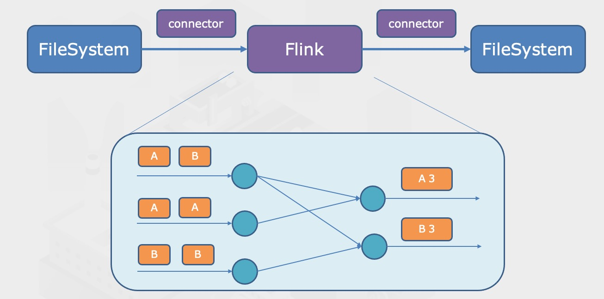
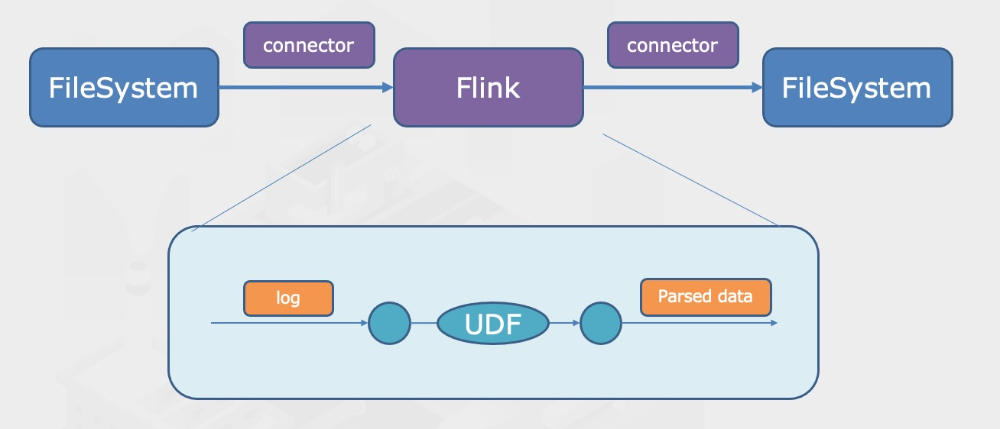
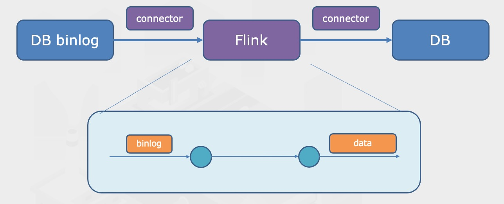
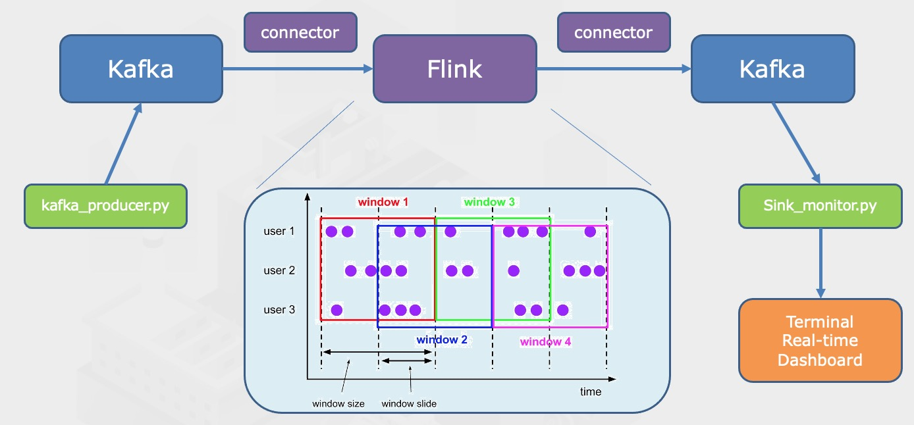
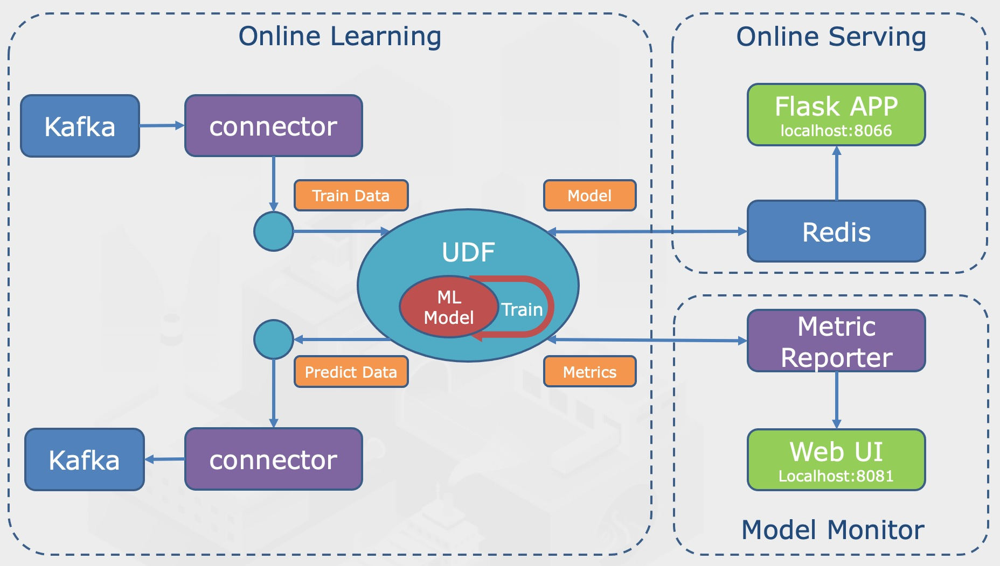
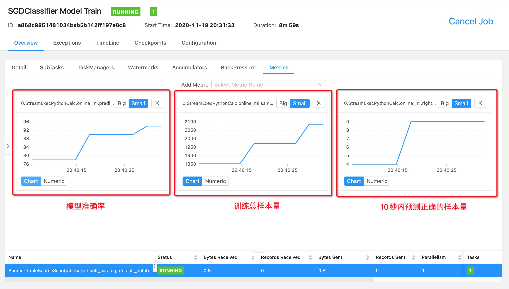

# PyFlink 从入门到精通

* [1、批处理 Word Count](#1批处理-word-count)
* [2、自定义函数 UDF](#2自定义函数-udf)
* [3、实时 MySQL CDC](#3实时-mysql-cdc)
* [4、有状态流处理](#4、有状态流处理)
    * [4.1、准备1：数据模拟器](#41准备1数据模拟器)
    * [4.2、准备2：kafka 监控](#42准备2kafka-监控)
    * [4.3、准备3：聚合函数](#43准备3聚合函数)
    * [4.4、运行](#44运行)
* [5、在线机器学习 Online Machine Learning](#5在线机器学习-online-machine-learning)


Flink 是目前非常火热的流处理框架，可以很好地实现批流一体，即一套代码即可以用于批处理，也可以用于流处理。

官方文档很好地解释了 Flink 的基础概念和工作原理，但是对于 Python 开发者而言少了很多例子，很难快速基于 PyFlink 进行开发。

本文档基于常见的业务场景，提供了一些案例，来帮助小伙伴们快速上手 PyFlink。

在上手之前，先大致介绍一下 PyFlink：
1. PyFlink 是 Flink 对 Java API 的一层封装，运行时会启动 JVM 来与 Python 进行通信。
2. Flink 提供了多种不同层级的 API，层级越高封装程度越高（建议在 SQL API 或 Table API 进行编程），层级由高到低分别为:
    1) SQL API
    2) Table API
    3) DataStream API / DataSet API
    4) Stateful Streaming Processing
3. Flink 在做批处理的时候，是将批数据当成特殊的流数据来处理。

本教程的建议使用步骤是：
1. 按顺序实践。
1. 阅读每个案例的代码，理解每个部分的作用。
1. 阅读每个案例的代码头部文档里提到的扩展阅读，加深理解。

再次强调，在运行前，先检查：
1. Python 版本是否是 3.5、3.6 或 3.7。
1. Docker 是否已经启动，MySQL、Kafka、Zookeeper 容器是否正在运行。
1. Flink 是否正确安装。

## 1、批处理 Word Count

> **业务场景**
> 
> 通过 Flink 对文件存储系统里的数据进行离线批处理，并将结果存储到其他文件下同下。



该案例展示了如何用 Flink 做批处理，统计指定文件下的单词数，并将统计结果写入到新的文件下。

cd 到 `examples/1_word_count` 路径下，运行命令为：

```
flink run -m localhost:8081 -py batch.py
```

很快就能运行完，登录 [http://localhost:8081](http://localhost:8081) 应该可以看到有个已经完成的任务。

`batch.py` 批处理脚本执行逻辑是：
1. 首先，创建 Blink 批处理环境。（关于 Blink 和 Flink 的区别，见脚本 `1_word_count/batch.py` 的文件头）。
2. 然后，创建源表（source），这里使用 `filesystem` 作为连接器，按照指定的 `csv` 格式来批量地读取指定路径的文件（或文件夹）。
3. 接着，创建结果表（sink），这里同样使用 `filesystem` 连接器，以便将处理后结果写入目标文件（或文件夹）内。
4. 最后，编写批处理逻辑，完成批处理任务。

对于上述每个阶段的实现，`batch.py` 脚本提供了基于 Table API 和基于 SQL API 这两种不同方式的实现。

SQL API 是对 Table API 的更高层次的封装，内部实现了一些优化，便于阅读，但相对地功能没有 Table API 来得全面和强大，本质上并无不同之处，读者根据需求可自行选择实现方法。

运行后的结果写到了同级目录下的 result.csv 中：

```
flink,3
pyflink,2
```

通过本案例，可以学到：
1. 如何创建批处理环境。
2. 如何创建数据源表和结果表，实现有单一流入和单一流出的 dataflow 的处理。
3. 如何用 Table API 和 SQL API 实现聚合逻辑。

## 2、自定义函数 UDF

> **业务场景**
> 
> 通过 Flink 对系统上报的日志进行实时解析并生成告警，搭建实时监控告警系统。



该案例是对线上实时监控告警的一小部分进行了改造（线上是流处理，本案例改成了批处理），展示了如何在 Flink 中使用自定义函数 UDF 、三方的依赖包，来实现复杂的日志解析逻辑。

同时，本案例也是 [官方文档](https://ci.apache.org/projects/flink/flink-docs-master/zh/dev/python/table-api-users-guide/udfs/python_udfs.html)
里的标量函数（ Scalar Function ）的一个简单实现，在 PyFlink 1.11 里的 UDF 已经比较强大了，更多技巧请前往官方文档进行学习。

本案例中，除了使用了自定义函数 UDF ，还使用了三方包 faker，因此需要额外提供一个描述依赖的文件 `requirements.txt` 。官方文档提供了两种方式来导入：

```python
# 方式1：直接传入 requirements.txt ，当集群可以联网时，会下载这些依赖项
t_env.set_python_requirements("requirements.txt")

# 方式2：当集群不能联网时，可以先准备好一个由 requirements.txt 生成的包含有安装包的依赖文件夹 cached_dir ，集群会离线安装这些依赖项
t_env.set_python_requirements("requirements.txt", "cached_dir")
```

方式 2 相比于方式 1 有两点好处：
1. 将依赖下载与作业执行解耦，提高了作业执行的效率。
1. 依赖项的安装包预先下载好，适用于集群不能联网的情况。

首先，cd 到 `examples/2_udf` 路径下，生成包含有安装包的 cached_dir 文件夹：

```bash
pip download -d cached_dir -r requirements.txt --no-binary :all:
```

然后，运行命令以提交批处理作业：

```bash
flink run -m localhost:8081 -py batch.py
```

登录 [http://localhost:8081](http://localhost:8081) 可以看到有个正在运行的任务，大约半分钟左右运行完。

运行后的结果写到了同级目录下的 result.csv 中：

```
syslog-system,爱尔兰,,,,,,
syslog-system,圣皮埃尔岛及密克隆岛,,,,,,
......
```

通过本案例，可以学到：
1. 如何创建并注册 UDF 。
1. 如何导入 python 的三方依赖包，并在 UDF 中使用。
1. 如何使用 UDF 。

## 3、实时 MySQL CDC

该案例展示了如何用 Flink 进行 MySQL 数据库的实时同步。

> **业务场景**
> 
> 监听 MySQL 的 binlog 数据变更，并实时同步到另一个 MySQL。



`CDC` 是 `change data capture`，即变化数据捕捉。CDC 是数据库进行备份的一种方式，常用于大量数据的备份工作。

CDC 分为入侵式的和非入侵式两种：
* 入侵式：如基于触发器备份、基于时间戳备份、基于快照备份。
* 非入侵式：如基于日志的备份。

MySQL 基于日志的 CDC 就是要开启 mysql 的 binlog（ binary log ）。
如果使用本教程的 docker-compose 安装的 MySQL 8.0.22，默认是开启 binlog 的。
实际业务 MySQL 可能未开启 binlog，可以通过执行下面的命令，查看 `log_bin` 变量的值是否为 `ON`。

```mysql
show variables like '%log_bin%';
```

为了在 Flink 中实现 MySQL 的 CDC，我们需要准备下面 3 个 jar 包（案例文件夹下面有）。
1. flink-connector-jdbc_2.11-1.11.2.jar：通过 JDBC 连接器来从 MySQL 里读取或写入数据。
2. flink-sql-connector-mysql-cdc-1.1.0.jar：通过 MySQL-CDC 连接器从 MySQL 的 binlog 里提取更改。
3. mysql-connector-java-5.1.49.jar：JDBC 连接器的驱动（ 帮助 java 连接 MySQL ）。

关于 jar 包的使用：
1. 创建 source 表的时候，定义连接器为 mysql-cdc ，写法请参照 [文档](https://ci.apache.org/projects/flink/flink-docs-stable/zh/dev/table/connectors/jdbc.html) 。
1. 创建 sink 表的时候，定义连接器为 jdbc，写法请参照 [文档](https://github.com/ververica/flink-cdc-connectors) 。
1. 由于 source 表可能有更新或删除，因此只能使用 upsert 模式来实现实时同步，该模式要求 sink 表里设置主键（ primary key）。

好了，简单介绍完 CDC，让我们进入正文。

cd 到 `examples/3_database_sync` 路径下，运行命令为：

```
python stream.py
```

PS：如果像前面案例一样使用 flink run 运行的话，会报错：`Caused by: java.lang.NoSuchMethodError: 'void sun.misc.Unsafe.monitorEnter(java.lang.Object)'`，暂时没有找到解决方法。。

如果本地有 MySQL 客户端，可以同时连接 3306 和 3307 这两个端口（账密都是 root）。在 3306 对应的实例上的 flink 数据库的 case3 这张表里做相应的增删改，然后看看 3307 对应的同名的表里，是否已经实时同步了数据。

通过本案例，可以学到：
1. 如何创建流处理环境。
2. 如何使用各类 connector ，以及如何管理在 pyflink 脚本中指定 jar 依赖。
3. 如何实现实时数仓的数据同步。

## 4、有状态流处理

> **业务场景**
> 
> 实时点击量排行榜。统计过去 1 分钟内，点击量最高的男女用户各 10 名及其具体的点击数，同时每隔 1 秒更新统计结果，并将统计结果同步到 kafka

该案例展示了如何用 Flink 进行有状态的流处理，通过 Slide 窗口函数实时更新统计结果，得到排行榜数据。



由于本案例稍微有些复杂，因此需要做一些前置准备 —— 数据模拟器和监控脚本 —— 然后再开始运行实时计算。

### 4.1、准备1：数据模拟器

首先，请保证 kafka 服务是正常运行的，且映射到 localhost:9092 。

在 `4_window` 目录下的 `kafka_producer.py` 脚本，提供了数据模拟器的功能。

它会往 kafka 服务的 user_action 主题里，每秒写入 20 条模拟数据，数据格式为 json 字符串，如下：

```bash
{
  "ts": "2020-01-01 01:01:01",  # 当前时间
  "name": "李华",  # 姓名
  "sex": "男",  # 性别，60%概率为“男”，40%概率为“女”
  "action": "click",  # 动作，90%概率为“click”，10%概率为“scroll”
  "is_delete": 0,  # 是否要丢弃，90%概率为“0”（不丢弃），10%概率为1“丢弃”
}
```

为了使得最后的结果不至于太平均，只初始化了 50 个用户，该 50 个用户有不同的概率来产生上面的数据。

运行命令如下：

```bash
python kafka_producer.py
```

### 4.2、准备2：kafka 监控

Flink 脚本会从 source 表里读取数据，经过实时计算后将结果写入 sink 表，其中 source 表与 sink 表分别对应着 kafka 的不同主题。

启动 2 个终端，其中一个用于监控 source 表（主题为 user_action ）
```basg
python source_monitor.py
``` 

可以看到有源源不断的数据被打印出来，如果觉得太多，可以终止该任务。

另一个终端用于监控 sink 表（主题为 click_rank ）

```bash
python sink_monitor.py
``` 

`sink_monitor.py` 脚本会将排行榜结果进行实时打印，当前还没有运行 Flink 作业，所以没有结果。

### 4.3、准备3：聚合函数

在 PyFlink 1.11.2 版本，还不支持用 Python 直接编写聚合函数（ UDAF ），因此需要先用 java 来编写聚合函数，然后以 jar 包的形式导入到 python 中。

本案例提供了 `flink-udf-1.0-SNAPSHOT.jar` UDF 包，内置了如下几种开箱即用的 UDF 或 UDTF:
1. JavaUpper：使用 java 的 String.toUpperCase 将字符串中的小写字母转大写，用法为 `JavaUpper(s)`。
1. Top2：继承自 TableAggregateFunction，用于 groupby 后统计最大的 2 个数，可参考 [表值聚合函数](https://ci.apache.org/projects/flink/flink-docs-release-1.11/zh/dev/table/functions/udfs.html#%E8%A1%A8%E5%80%BC%E8%81%9A%E5%90%88%E5%87%BD%E6%95%B0) ，用法为 `Top2(value)`。
1. TopN：本次案例的主角，继承自 AggregateFunction，用于 groupby 后统计出现次数最多的 N 个名称及其出现次数，并将结果拼接为字符串（如 `"{\"name1\":count1}, {\"name2\":count2}, ..."`），用法为 `TopN(name, N, 1)`，其中 N 是 TopN 里的 N，为固定值。
1. WeightedAvg：继承自 AggregateFunction，用于 groupby 后统计出加权平均值，用法为 `WeightedAvg(value, weight)`。

如果还要自行开发 udf 的话，可以参考 4_window/java_udf 目录，在 src/main/java/com/flink/udf 下编写 java 脚本，具体写法此处不赘述。

udf 开发完之后，在 java_udf 的根路径下，使用 maven 进行打包：

```bash
mvn clean package
```

几秒之后，打包完的 jar 包会在当前目录新生成一个 target 文件夹，名为 flink-udf-1.0-SNAPSHOT.jar ，拷贝出来放在 4_window 下面即可替换掉原来的 flink-udf-1.0-SNAPSHOT.jar 即可。

### 4.4、运行

cd 到 `examples/4_window` 路径下，运行命令为：

```bash
flink run -m localhost:8081 -py stream11.py
```

运行之后，可以在 [localhost:8081](localhost:8081) 看到提交的名为 `Top10 User Click` 的 flink 作业。

PS: control + C 不能彻底终止脚本，因为脚本已经提交了，需要在 [localhost:8081](localhost:8081) 里点击对应的 job 然后再点击右上角的 Cancel Job 才算彻底终止。

同时，可以在前面运行 `sink_monitor.py` 监控脚本的终端里看到实时更新的排行榜数据。此处为了简化显示，排行榜只看 top5，如下:

```bash
=== 男 ===
刘备    80
张飞    72
韩信    70
关云长  30
曹操    23
=== 女 == 
大乔    60
小乔    55
貂蝉    32
甄宓    13
蔡琰    4
```

下面对 `stream11.py` 脚本里的重要内容做一下说明。

首先，要使用 TopN 聚合函数，注册步骤为 3 步，如下所示：

```python
import os
from pyflink.datastream import StreamExecutionEnvironment
from pyflink.table import StreamTableEnvironment, EnvironmentSettings

# 第一步：初始化流处理环境，注意此处一定要指定 StreamExecutionEnvironment，否则无法导入 java 函数
env = StreamExecutionEnvironment.get_execution_environment()
env_settings = EnvironmentSettings.new_instance().in_streaming_mode().use_blink_planner().build()
t_env = StreamTableEnvironment.create(env, environment_settings=env_settings)

# 第二步：导入 jar 包依赖
dir_java_udf = os.path.join(os.path.abspath(os.path.dirname(__file__)), 'flink-udf-1.0-SNAPSHOT.jar')
t_env.get_config().get_configuration().set_string("pipeline.classpaths", 'file://' + dir_java_udf)

# 第三步，注册 java 函数，命名为 getTopN
t_env.register_java_function('getTopN', 'com.flink.udf.TopN')
```

getTopN 函数的使用就跟 mysql 里的 sum 等函数差不多。

本次希望实现一个排行榜的功能，滑动窗口宽度为 1 分钟（即对过去的 1 分钟数据进行统计），窗口滑动步长为 1 秒（即每 1 秒更新一次统计结果），同时还希望可以区分男女，因此在聚合的时候，要对窗口和性别同时进行聚合。

有 2 种方式来实现：
1. 基于 SQL API:
    1. 在 GROUP BY 里使用 HOP 滑动窗口函数，入参分别为：时间戳、滑动步长、窗口长度
    1. 在 SELECT 里使用 HOP_START 和 HOP_END 来获得滑动窗口的开始时间和结束时间
1. 基于 Table API:
    1. 创建长度为 60 秒、滑动步长为 1 秒的滑动窗口 slide_window ，并重命名为 w
    1. 使用 w.start, w.end 来获得滑动窗口的开始时间与结束时间

两种的具体实现，均已在 `stream11.py` 脚本里，可自行查阅。

通过本案例，可以学到：
1. 如何导入 java 依赖包。
1. 如何调整流处理环境的初始化，来注册自定义的 java 聚合函数。
1. 如何在滑动窗口中使用聚合函数。

## 5、在线机器学习 Online Machine Learning

> **业务场景**
> 
> 在实时流处理场景中，在线训练一个机器学习模型，并实现对模型训练过程的实时监控。

该案例展示了如何用 PyFlink + Scikit-Learn 进行在线机器学习，基于 Scikit-Learn 的 Digits 手写数据集，训练出一个分类模型，并利用自定义的 Metrics 实现模型指标的实时监控。



> 待补充



通过本案例，可以学到：
1. 如何在 Flink UDF 中使用 Scikit-Learn 包
1. 加载模型和保存模型
1. 定义和管理不同类型的指标 Metric
1. 在 Web 页面上实时查看指标，了解算法的运行情况